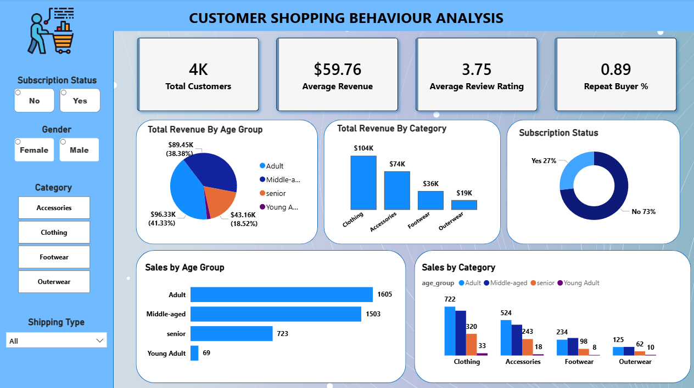

# 🛍️ Customer Shopping Behavior Analysis — SQL | Python | Power BI

<h2>📌 Overview </h2>
This project analyzes customer shopping behavior for a retail company to uncover trends, purchasing patterns, and factors influencing repeat purchases. Using Python for data preparation, SQL for analytical querying, and Power BI for visualization, the project delivers actionable insights that help improve customer engagement, optimize marketing strategies, and support data‑driven decision‑making.

<h2>🎯 Project Objective</h2>
The goal of this project is to understand how customers shop across demographics, product categories, seasons, and channels (online/offline).
The analysis focuses on identifying: 

<li> What drives customer purchases</li>
<li> Which factors influence repeat buying</li>
<li> How discounts, reviews, and payment preferences affect behavior</li>
<li> How customer segments differ in loyalty and spending</li>
<li> Opportunities to improve sales and retention</li>
This end‑to‑end workflow demonstrates real‑world analytics skills across data cleaning, modeling, SQL analysis, and dashboard storytelling.

<h2>⭐ Key Features</h2> 
<h3>Data Cleaning & Preparation (Python)</h3>
<li>Handled missing values, standardized formats, and prepared the dataset for analysis.</li>
<h3>SQL‑Based Insights</h3>
<li>Customer segmentation</li>
<li>Repeat buyer identification</li>
<li>Seasonal and category‑level trends</li>
<li> Discount and review impact analysis</li>
<h3>Interactive Power BI Dashboard</h3>
<li>KPI cards for quick business insights</li>
<li>Visual exploration of customer behavior</li>
<li>Filters for demographics, categories, and channels</li> 

<h2>🛠️ Tools & Technologies</h2>
<li>Python — Data cleaning, preprocessing</li>
  Pandas — Data manipulation
<li> SQL — Analytical queries and segmentation</li>
<li>Power BI — Dashboard creation and visualization</li>
<li>GitHub — Version control and project documentation</li>

<h2>🖼️ Screenshots</h2>

<h2>📝 Notes</h2>
-This project simulates a real‑world analytics workflow from raw data to business insights.
-The dashboard is fully interactive and designed for decision‑makers.

